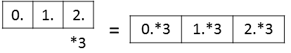
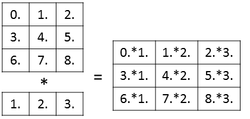

class:center,middle

# Introduction to NumPy
# for Machine Learning Programmers

Kimikazu Kato

---
# Target Audience

---
# Outline

* Preliminaries
    - Basic usage of NumPy
    - Indexing, Broadcasting
* Case study
    - Reading source code of scikit-learn
* Conclusion

---
---
## But Python is Very Slow!
Code in C
```C
#include <stdio.h>
int main() {
  int i; double s=0;
  for (i=1; i<=100000000; i++) s+=i;
  printf("%.0f\n",s);
}
```

Code in Python
```Python
s=0.
for i in xrange(1,100000001):
    s+=i
print s
```

Both of the codes compute the sum of integers from 1 to 100,000,000.

Result of benchmark in a certain environment:<br/>
Above: 0.109 sec (compiled with -O3 option)<br/>
Below: 8.657 sec<br/>
(80+ times slower!!)

---
## Better code

```Python
import numpy as np
a=np.arange(1,100000001)
print a.sum()
```
Now it takes 0.188 sec. (Measured by "time" command in Linux, loading time included)

Still slower than C, but sufficiently fast as a script language.

---
## Lessons

* Python is very slow when written badly 
* Translate C (or Java, C# etc.) code into Python is often a bad idea.
* Python-friendly rewriting sometimes result in drastic performance improvement

---
## Basic rules for better performance

* Avoid for-sentence as far as possible
* Utilize libraries' capabilities instead
* Forget about the cost of copying memory
    - Typical C programmer might care about it, but ...

---
## Basic techniques for NumPy

* Broadcasting
* Indexing

---
## Broadcasting
```python
>>> import numpy as np
>>> a=np.array([0,1,2,3])
>>> a*3
array([0, 3, 6, 9])
```

---
## Broadcasting (2D)

```Python
>>> import numpy as np
>>> a=np.arange(9).reshape((3,3))
>>> b=np.array([1,2,3])
>>> a
array([[0, 1, 2],
       [3, 4, 5],
       [6, 7, 8]])
>>> b
array([1, 2, 3])
>>> a*b
array([[ 0,  2,  6],
       [ 3,  8, 15],
       [ 6, 14, 24]])
```


---
## Indexing

```python
>>> import numpy as np
>>> a=np.arange(10)
>>> a
array([0, 1, 2, 3, 4, 5, 6, 7, 8, 9])
>>> indices=np.arange(0,10,2)
>>> indices
array([0, 2, 4, 6, 8])
>>> a[indices]=0
>>> a
array([0, 1, 0, 3, 0, 5, 0, 7, 0, 9])
>>> b=np.arange(100,600,100)
>>> b
array([100, 200, 300, 400, 500])
>>> a[indices]=b
>>> a
array([100,   1, 200,   3, 300,   5, 400,   7, 500,   9])
```

---
## Refernces

* Gabriele Lanaro, "Python High Performance Programming," Packt Publishing, 2013.
* Stéfan van der Walt, [Numpy Medkit](http://mentat.za.net/numpy/numpy_advanced_slides/)

---
# Case Study 1: Ridge Regression
(`sklearn.linear_model.Ridge`)

`$$ \min_w \Vert y - Xw \Vert_2^2 + \alpha \Vert w \Vert_2^2 $$`

* `$X$`, `$y$`: input, output of training data
* `$alpha$` : hyper parameter

The optimum is given as:
`$$ w = (X^T X + \alpha I)^{-1} X^T y $$`

The corresponding part of the code:

```python
            K = safe_sparse_dot(X, X.T, dense_output=True)
            try:
                dual_coef = _solve_cholesky_kernel(K, y, alpha)

                coef = safe_sparse_dot(X.T, dual_coef, dense_output=True).T
            except linalg.LinAlgError:
```
([sklearn/linear_model/ridge.py](https://github.com/scikit-learn/scikit-learn/blob/0.16.X/sklearn/linear_model/ridge.py) L338)

---
`$$ w = (X^T X + \alpha)^{-1} X^T y $$`
```python
            K = safe_sparse_dot(X, X.T, dense_output=True)
            try:
                dual_coef = _solve_cholesky_kernel(K, y, alpha)

                coef = safe_sparse_dot(X.T, dual_coef, dense_output=True).T
            except linalg.LinAlgError:
```

* `safe_sparse_dot` is a wrapper function of `dot` which can be applied to sparse and dense matrices.
* `_solve_cholesky_kernel` computes $(K+ \alpha I)^{-1}y$

---
# Inside `_solve_cholesky_kernel`


---
# Case Study 2: NMF

`sklearn.decomposition.nmf`

NMF = Non-negative Matrix Factorization

Successful in face part detection


---
# Idea of NMF

Approximate the input matrix as a product of two smaller non-negative matrix:
`$$ X \approx WH $$`
`$$ W_{ij}\geq 0,\  H_{ij}\geq 0$$`

### Notation

Parameter set:
`$$ \Theta = (W,H), \quad \theta_i \text{ : } i \text{-th element of } \Theta $$`
Error function:
`$$ f(\Theta) = \Vert X - WH \Vert_F^2$$`

---
# Algorithm of NMF

Projected gradient descent (Lin 2007):

`$$ \Theta^{(k+1)} = P \left[\Theta^{(k)} - \alpha \nabla f(\Theta^{(k)})  \right]$$`
where
`$$ P[x]_i = \max (0,x_i) $$`

Convergence condition:
`$$ \nabla^P f(\Theta^{(k)}) \leq \epsilon \nabla^P f(\Theta^{(1)}) $$`
where
`$$ \nabla^P f(\Theta) =\left\{
\begin{array}{ll}
\nabla^P f(\Theta)_i & \text{if } \theta_i>0 \\
\max \left( 0, \nabla^P f(\Theta)_i \right) & \text{if } \theta_i=0
\end{array}
\right.
$$`
(Note: `$\theta_i\geq 0$`)

---

Computation of
`$$ \nabla^P f(\Theta) =\left\{
\begin{array}{ll}
\nabla^P f(\Theta)_i & \text{if } \theta_i>0 \\
\max \left( 0, \nabla^P f(\Theta)_i \right) & \text{if } \theta_i=0
\end{array}
\right.
$$`

Code:
```python
            proj_norm = norm(np.r_[gradW[np.logical_or(gradW < 0, W > 0)],
                                   gradH[np.logical_or(gradH < 0, H > 0)]])
```
([sklearn/decomposition/nmf.py](https://github.com/scikit-learn/scikit-learn/blob/0.16.X/sklearn/decomposition/nmf.py) L500)

`norm` : utility function of scikit-learn which computes L2-norm

---
References

* C.-J. Lin. Projected gradient methods for non-negative matrix factorization. Neural Computation 19, 2007.
